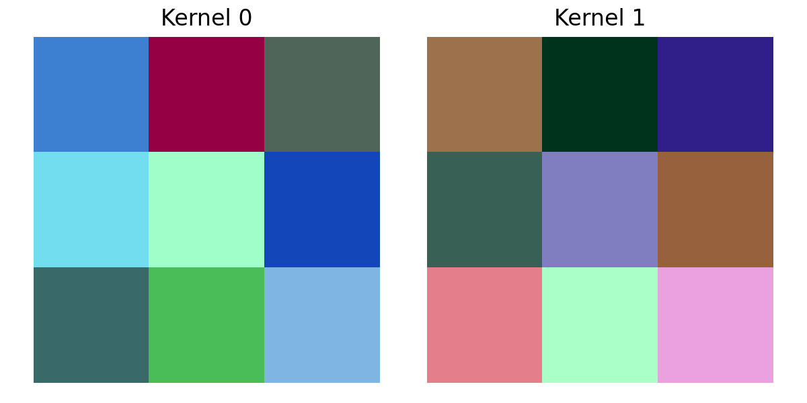

# CIFAR-10 CNN Image Classification

本專案使用 **CIFAR-10** 影像資料集，完成從資料準備、CNN 影像分類、Hyperparameter Experiment，到 Data Augmentation 與 Explainable AI（XAI）的完整實驗流程。

---

## 1. Dataset

### 1.1 Dataset Introduction

本實驗使用 **CIFAR-10** 影像資料集。

CIFAR-10 共包含 10 個影像類別:

| Class ID | Class |
|---:|---|
| 0 | airplane |
| 1 | automobile |
| 2 | bird |
| 3 | cat |
| 4 | deer |
| 5 | dog |
| 6 | frog |
| 7 | horse |
| 8 | ship |
| 9 | truck |

每張影像為 **32 × 32 pixels、RGB 三通道**。

由於 CIFAR-10 的原始影像解析度只有 32 × 32，因此在資料視覺化與 Grad-CAM 結果中，影像可能會呈現較模糊的情況。這是資料集本身的解析度限制，並非模型訓練過程造成。

### 1.2 Dataset Split

CIFAR-10 原始資料包含:

- Training Dataset: 50,000 images
- Testing Dataset: 10,000 images

本實驗將原始 Training Dataset 進一步切分為: 

- Training: 40,000 images
- Validation: 10,000 images
- Testing: 10,000 images

Training Dataset 用於模型訓練，Validation Dataset 用於模型選擇與超參數調整，Testing Dataset 則保留至最後進行模型評估。

### 1.3 Problem Definition

本實驗為一個 **10-class image classification problem**。

給定一張 CIFAR-10 RGB 影像，模型需要從 10 個類別中預測該影像所屬的類別。

輸入: 

```text
32 × 32 × 3 RGB image
```

輸出: 

```text
10-class probability
```

最終以機率最高的類別作為模型的 Top-1 prediction。

---

# 2. Quiz 2 — CNN Image Classification

本實驗比較兩種 CNN: 

1. 自行設計的 Plain CNN
2. 經典 CNN Backbone：ResNet18

兩個模型皆使用 CIFAR-10 進行訓練與測試。

---

## 2.1 Plain CNN

Plain CNN 為自行設計的卷積神經網路，透過多層 Convolution、Activation、Pooling 與 Fully Connected Layer 完成影像分類。

模型參數量: 

```text
620,362 parameters
```

### Baseline Results

| Metric | Validation | Testing |
|---|---:|---:|
| Top-1 Accuracy | 75.42% | 75.03% |
| Top-5 Accuracy | 98.09% | 98.04% |

### ROC / AUC

Plain CNN 的 Macro-AUC: 

```text
0.965353
```

---

## 2.2 ResNet18

第二個模型使用經典 CNN Backbone **ResNet18**。

ResNet18 透過 Residual Connection 來改善深層網路的訓練問題，使網路能夠使用更深的架構進行特徵學習。

模型參數量: 

```text
11,181,642 parameters
```

### Baseline Results

| Metric | Validation | Testing |
|---|---:|---:|
| Top-1 Accuracy | 84.44% | 84.23% |
| Top-5 Accuracy | 99.01% | 98.93% |

### ROC / AUC

ResNet18 的 Macro-AUC: 

```text
0.983190
```

---

## 2.3 Plain CNN vs ResNet18

| Model | Parameters | Test Top-1 | Test Top-5 | Macro-AUC |
|---|---:|---:|---:|---:|
| Plain CNN | 620,362 | 75.03% | 98.04% | 0.965353 |
| ResNet18 | 11,181,642 | 84.23% | 98.93% | 0.983190 |

### Observation

ResNet18 的分類表現明顯優於自行設計的 Plain CNN。

在 Testing Dataset 上: 

- Top-1 Accuracy: 84.23% vs 75.03%
- Top-5 Accuracy: 98.93% vs 98.04%
- Macro-AUC: 0.983190 vs 0.965353

ResNet18 使用約 11.18M 個參數，而 Plain CNN 僅約 0.62M 個參數。雖然 ResNet18 的模型規模明顯較大，但其較深的網路架構與 Residual Connection 能夠學習更複雜的影像特徵，因此得到較好的分類結果。

這也顯示模型參數量與分類能力之間存在一定的關係，但參數量增加同時也會帶來更高的計算與記憶體需求。

---

# 3. Hyperparameter Experiment

為了觀察不同超參數對模型訓練結果的影響，本實驗針對 Plain CNN 與 ResNet18 分別測試不同 Learning Rate。

## 3.1 Plain CNN

Plain CNN 實驗結果顯示，較適合本模型的 Learning Rate 為: 

```text
Learning Rate = 0.001
```

最佳 Validation 結果:

| Metric | Result |
|---|---:|
| Top-1 Accuracy | 75.21% |
| Top-5 Accuracy | 98.24% |
| Best Epoch | 20 |

不同 Learning Rate 會影響模型參數更新的幅度。Learning Rate 過大可能造成訓練過程震盪，而過小則可能使模型收斂速度過慢，因此需要透過實驗尋找適合模型的設定。

---

## 3.2 ResNet18

ResNet18 實驗中，不同 Learning Rate 對模型表現亦有明顯影響。

最佳設定為: 

```text
Learning Rate = 0.0001
```

最佳 Validation 結果: 

| Metric | Result |
|---|---:|
| Top-1 Accuracy | 86.28% |
| Top-5 Accuracy | 99.29% |
| Best Epoch | 19 |

相較於 Plain CNN，ResNet18 的架構較深，因此 Learning Rate 的設定對訓練穩定性更加重要。

---

# 4. Quiz 3 — Data Augmentation

為提升模型的泛化能力，本實驗在 Training Dataset 加入 Data Augmentation。

使用的 augmentation strategy：

```text
RandomCrop(32, padding=4)
RandomHorizontalFlip
```

其中：

- `RandomCrop(32, padding=4)`：先在影像周圍加入 padding，再隨機裁切回 32×32。
- `RandomHorizontalFlip`：以隨機方式將影像水平翻轉。

只有 Training Dataset 使用隨機 Data Augmentation。Validation Dataset 與 Testing Dataset 不使用隨機 augmentation，以確保評估結果具有一致性。

---

## 4.1 Plain CNN with Data Augmentation

| Model | Test Top-1 | Test Top-5 | Macro-AUC |
|---|---:|---:|---:|
| Plain CNN | 74.22% | 97.87% | 0.963582 |
| Plain CNN + Augmentation | **75.61%** | **98.41%** | **0.969265** |

### Observation

加入 Data Augmentation 後，Plain CNN 的 Test Top-1 Accuracy 從 **74.22% 提升至 75.61%**，增加 **1.39 percentage points**。

Test Top-5 Accuracy 也從 **97.87% 提升至 98.41%**，而 Macro-AUC 則由 **0.963582 提升至 0.969265**。

這表示 Data Augmentation 對 Plain CNN 的泛化能力具有正面影響。透過 RandomCrop 與 RandomHorizontalFlip，模型在訓練過程中可以看到不同位置與方向的影像，因此較不容易過度依賴特定的影像位置或外觀。

不過，提升幅度相對有限，可能與 Plain CNN 本身的模型容量較小有關。

---

## 4.2 ResNet18 with Data Augmentation

| Model | Test Top-1 | Test Top-5 | Macro-AUC |
|---|---:|---:|---:|
| ResNet18 | 86.17% | 99.40% | 0.987080 |
| ResNet18 + Augmentation | **89.48%** | **99.61%** | **0.993201** |

### Observation

ResNet18 加入 Data Augmentation 後，Test Top-1 Accuracy 從 **86.17% 提升至 89.48%**，增加 **3.31 percentage points**。

同時，Test Top-5 Accuracy 從 **99.40% 提升至 99.61%**，Macro-AUC 則由 **0.987080 提升至 0.993201**。

相較於 Plain CNN，ResNet18 從 Data Augmentation 中獲得更明顯的 Top-1 Accuracy 提升。這表示較深的 CNN 架構能夠更有效地利用 augmentation 所提供的影像變化，學習具有較好泛化能力的特徵。

此外，ResNet18 + Augmentation 的最佳 Validation Top-1 Accuracy 達到 **90.03%**，明顯高於未使用 augmentation 時的 **86.29%**。

整體而言，Data Augmentation 對兩種模型皆有正面效果，其中對 ResNet18 的改善更加明顯。

## 4.3 Overall Comparison

| Model | Augmentation | Parameters | Best Val Top-1 | Test Top-1 | Test Top-5 | Macro-AUC |
|---|---|---:|---:|---:|---:|---:|
| Plain CNN | No | 620,362 | 74.77% | 74.22% | 97.87% | 0.963582 |
| Plain CNN | Yes | 620,362 | 75.73% | 75.61% | 98.41% | 0.969265 |
| ResNet18 | No | 11,181,642 | 86.29% | 86.17% | 99.40% | 0.987080 |
| ResNet18 | Yes | 11,181,642 | **90.03%** | **89.48%** | **99.61%** | **0.993201** |

### Overall Observation

Data Augmentation 對兩種模型皆帶來改善。

Plain CNN 的 Test Top-1 Accuracy 提升 **1.39 percentage points**，而 ResNet18 提升 **3.31 percentage points**。這表示 ResNet18 在加入 Data Augmentation 後獲得更明顯的泛化能力提升。

在本實驗中，表現最佳的模型為 **ResNet18 + Data Augmentation**，其 Test Top-1 Accuracy 為 **89.48%**、Test Top-5 Accuracy 為 **99.61%**，Macro-AUC 為 **0.993201**。

因此，本實驗結果顯示 Data Augmentation 能有效改善模型在未見測試資料上的分類表現，而 ResNet18 相較於 Plain CNN 能更充分利用 augmentation 所產生的影像變化。
---

# 5. CNN Kernel Visualization

為了觀察 CNN 在訓練後所學習到的特徵，本實驗視覺化其中兩個 Convolution Kernel。

CNN Kernel 可以理解為一組用來偵測影像局部特徵的權重。

在較淺層的 CNN 中，Kernel 通常會學習較基礎的視覺特徵，例如: 

- Edge
- Direction
- Texture
- Local pattern

因此可以透過觀察 Kernel 的權重分布，分析模型可能正在偵測哪些影像特徵。

以下為訓練後 Plain CNN 的兩個 Kernel visualization。



### Kernel 1

Kernel 1 主要呈現模型學習到的局部影像特徵，例如邊緣或方向性的 pattern。

### Kernel 2

Kernel 2 學習到不同的局部特徵，與 Kernel 1 呈現不同的 activation pattern。

---

# 6. Explainable AI — Saliency Map

為了解釋 CNN 的預測結果，本實驗使用 **Saliency Map** 分析模型在進行影像分類時所關注的影像區域。

Saliency Map 透過計算模型輸出對輸入影像各像素的梯度，衡量影像中的哪些位置對模型的預測結果較為重要。當某個區域具有較高的 saliency 值時，代表該區域的像素變化對模型的預測具有較大的影響。

本實驗選擇一張模型正確預測為 `cat` 的 CIFAR-10 影像進行分析。

### 6.1 Visualization

> 此處放置 Original Image、Saliency Map 與 Overlay。

### 6.2 Analysis

從 Saliency Map 可以觀察到，模型的高反應區域主要集中在**貓的臉部、頭部以及身體附近**。

在 Overlay 結果中，可以看到較明顯的高重要性區域主要落在貓本身，而不是完全集中於背景區域。這表示模型在判斷該影像為 `cat` 時，主要使用貓本身的視覺特徵，例如臉部輪廓、頭部以及身體的局部特徵。

雖然背景區域也存在一些 saliency response，但相較之下，貓本身的區域具有較明顯的反應。因此，這個結果顯示模型的預測具有一定程度的可解釋性，其分類依據與影像中的主要物體具有關聯。

不過，由於 CIFAR-10 的原始影像解析度只有 **32×32 pixels**，影像本身的細節有限，因此 Saliency Map 也會受到低解析度的影響。圖中的高亮區域應主要解讀為模型所關注的**大致區域**，而不是精確到單一像素的語意判斷。

### 6.3 XAI Result

本實驗的模型正確預測: 

```text
True Label: cat
Predicted Label: cat
```

Saliency Map 顯示模型主要關注貓的臉部、頭部與身體區域，表示模型在此案例中並非完全依賴背景資訊，而是有利用影像中與 `cat` 類別相關的視覺特徵進行分類。

---

# 7. Overall Results

目前兩個主要 CNN 的結果如下: 

| Model | Parameters | Test Top-1 | Test Top-5 | Macro-AUC |
|---|---:|---:|---:|---:|
| Plain CNN | 620,362 | 75.03% | 98.04% | 0.965353 |
| ResNet18 | 11,181,642 | **84.23%** | **98.93%** | **0.983190** |

ResNet18 在 Top-1 Accuracy、Top-5 Accuracy 以及 Macro-AUC 三項指標皆優於 Plain CNN。

其中最大的差異出現在 Top-1 Accuracy: 

```text
ResNet18       84.23%
Plain CNN      75.03%
Difference      9.20%
```

這表示 ResNet18 能夠更準確地判斷影像的第一順位類別。

然而，ResNet18 的參數量約為 Plain CNN 的 18 倍，因此模型表現的提升同時也伴隨更高的模型複雜度。

---

# 8. Conclusion

本次 Quiz 1–3 從資料準備、CNN 訓練、超參數實驗，到 Data Augmentation 與 XAI，完整實作了一個影像分類流程。

主要觀察如下：

1. **CIFAR-10 是一個 10-class image classification dataset，原始影像大小為 32×32。**
2. **ResNet18 的分類表現優於自行設計的 Plain CNN。**
3. 在 Quiz 2 baseline experiment 中，ResNet18 在 Testing Dataset 上達到 **84.23% Top-1 Accuracy** 與 **98.93% Top-5 Accuracy**，優於 Plain CNN 的 75.03% 與 98.04%。
4. ResNet18 的 Macro-AUC 為 **0.983190**，高於 Plain CNN 的 **0.965353**。
5. 不同 Learning Rate 會影響模型的收斂與最終表現，因此需要透過實驗選擇適合的超參數。本實驗中，Plain CNN 使用 **0.001**，ResNet18 使用 **0.0001**。
6. **Data Augmentation 對兩種模型皆帶來正面效果。** Plain CNN 的 Test Top-1 Accuracy 由 74.22% 提升至 75.61%，ResNet18 則由 86.17% 提升至 89.48%。
7. **ResNet18 + Data Augmentation 為本實驗表現最佳的模型**，Test Top-1 Accuracy 達到 **89.48%**、Test Top-5 Accuracy 達到 **99.61%**，Macro-AUC 為 **0.993201**。
8. CNN Kernel Visualization 可以幫助觀察模型訓練後學習到的低階視覺特徵與局部 pattern。
9. Saliency Map 可以進一步分析模型預測時對輸入影像不同區域的敏感程度。
10. 由於 CIFAR-10 原始解析度僅為 **32×32 pixels**，Saliency Map 的空間解析度有限，因此本實驗主要著重於模型關注區域的大致位置。

除了比較不同 CNN 架構的分類能力，也進一步從 **Hyperparameter、Data Augmentation 與 Explainable AI** 等角度分析影像分類模型的訓練結果與預測行為。實驗結果顯示，較深的 ResNet18 搭配 Data Augmentation 能夠取得最佳的分類表現，而 XAI 方法則能進一步提供模型預測行為的視覺化分析。
